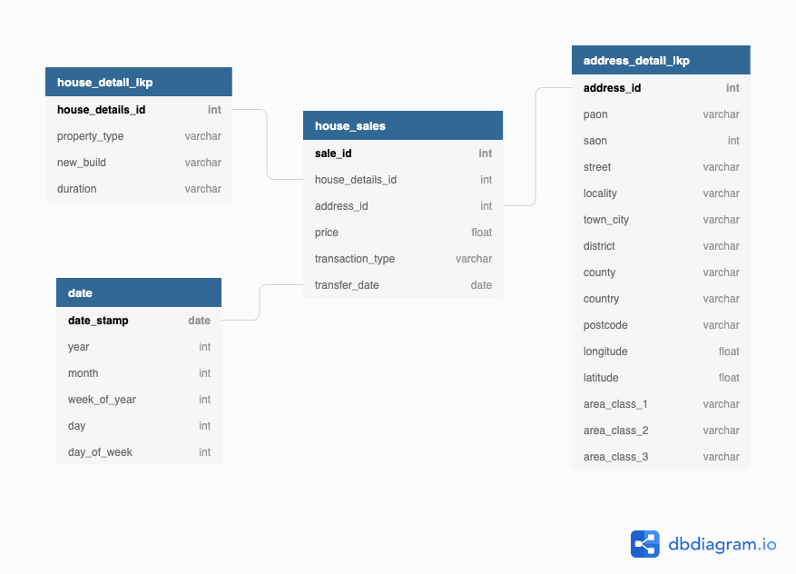

# Data Engineering Capstone Project

This project contains the code files for the implementation of the Capstone Project for my Udacity Data Engineering Nanodegree.

# Table of Contents
1. [Motivation](#1.-Motivation)
2. [The data model](#2.-The-data-model)
3. [Data sources](#3.-Data-sources)
4. [The files in this repo](#4.-The-files-in-this-repo)
5. [The data pipeline](#5.-The-data-pipeline)
6. [How this project would change with extra requirements](#6.-How-this-project-would-change-with-extra-requirements)
7. [Updating the data](#7.-Updating-the-data)
8. [Data Dictionary](#8.-Data-Dictionary)
9. [Licenses](#9.-Licenses)

## 1. Motivation

In this project I wanted to create a database that could be used for analysing historical residential housing transactions in the UK. On top of just getting the basic address information, I wanted to supplement this data with additional information. This data was the longitude and lattitudes of the properties, and the area classifications by postcodes for the data. With expanding the transfer date feature into its own table to extract data on the year, month, week and day of the transaction, the final data model is able to answer a lot more questions in a simpler way than if we stuck with the basic archival price-paid data from the UK government.

I see this data as being able to populate a monthly dashboard for summary statistics on things like:

- average price of sale
- breakdown by region of sales figures
- distribution of sale prices
- how different area classifications are performing to help identify traits of areas with greater / lower house turnover
- the best days of the week for sales in that month
- the types of properties that sell best by postcode

### 1.1 Tech choices

I chose to implement this database on Amazon Redshift. This is because I was dealing with Big Data, i.e., there were over 25 million rows in one of my datasets. This would be far too much for my local CPU to handle, hence the choice of a cloud based solution.

The data was stored in an S3 bucket to take advantage of the COPY functionality from S3 to Redshift.

## 2. The data model

The entity relationship diagram for this model is shown below. I chose a simple star schema: a single fact table for house sales, and three dimension tables for the house details, the date of transfer, and the address details. This makes it more efficient if we only want to consider time-based trends independent of location (or vice-versa).

## 3. Data sources

### Houses Price Paid

A file of all property sales in the UK in the years 1995-2020 from [HM Land Registry](https://www.gov.uk/government/statistical-data-sets/price-paid-data-downloads#single-file). The file to download is "the complete Price Paid Transaction Data", around 3.7GB. However, if you want to test how this code works with a smaller sample (so that the upload times to S3 are not astrononmical), you can use one of the complete yearly datasets, e.g., for 2019, around 24.5MB.

### Postcodes

A file for supplementary data on all of the UK postcodes as of Feb 2020 from the [Office of National Statistics](https://geoportal.statistics.gov.uk/datasets/national-statistics-postcode-lookup-february-2020).

## 4. The files in this repo

### 4.1 Jupyter notebook

- `Summary-Notebook.ipynb`: contains the bulk of the ETL pipeline and example queries at the end for some results of how the database works

### 4.2 Python scripts

- `clean_postcode_data.py`: for cleaning the postcode data taken from the source ready for later in the pipeline

- `upload_data`: for uploading the price paid and cleaned postcode data to the S3 bucket of the user

- `sql_queries.py`: this is the file that contains all of the SQL queries for creating and dropping the tables as well as copying and inserting / updating the data in these tables.

- `create_tables.py`: this file contains the code that (drops and then) creates the tables in the Amazon Refshift cluster.

- `etl.py`: this file contains the code for copying the data from S3 into the staging tables and inserting data from these tables into the final tables.

### 4.3 Miscellaneous

- `schema.txt`: the code used on [dbdiagram.io](https://dbdiagram.io/home) to create the schema image included

- `erd.png`: the entity relationship diagram image

- `dwh-template.cfg`: template for you own configuration file

## 5. The data pipeline

I decided to use an Amazon Redshift cluster. The data are downloaded from the mentioned sources and then uploaded to an S3 bucket. The two sets of data are then loaded into two staging tables on an Amazon Redshift cluster. SQL code transformations are executed on the data which is then loaded into final tables as detailed in the schema.

### 5.1 How to run

Before starting the ETL process you will have to update the `dwh.cfg` file template in this repo. You will also have to go to the data source links and download the files into a sensible place.

The steps in this ETL process are as followed:

1. Extract the data from the sources.

2. Clean the postcodes data with `clean_postcodes_data`. This function takes the filepath of the file to clean as an argument.

3. Upload all data to the S3 bucket as defined in the `dwh.cfg` configuration file with `upload_data.py`. After this you will have to update the config file with the new filepaths of the data.

4. Create the tables in the Amazon Redshift with `create_tables.py`.

5. Run the ETL process with `etl.py`.

### 5.2 Data quality checks

After the files were run I did some basic data quality checks that can be found at the end of the `Summary-Notebook.ipynb`. However, here we can talk about some of them here.

### 5.2.1 NOT NULL constraing

I used the NOT NULL constraint when creating the tables (see `sql_queries.py`) to help ensure the data quality of the features where this was relevant.

### 5.2.2 Missing postcodes

There were some gaps in the data with the addresses and postcodes. Given that postcodes can be discoutinued, some of the postcodes in the prices-paid dataset were not joined with an entry in the postcodes dataset. On one test, this came out at 67,742 out of 17,228,299 distinct addresses - aounrd 0.39% of the total.

### 5.2.3 Populated tables

One very basic check is to see if the tables are actually populated. I have queried samples from the tables in the above notebook, section 4. We see that we get sensible data back.

## 6. How this project would change with extra requirements

### 6.1 What about data 100x bigger?

In this case I would likely transfer across to PySpark for processing. At the minute some data cleaning is done within a Python script using pandas dataframes due to their ease and familiarity. However, as the data grows, making use of a dsitributed cluster would be sensible as the local memory would rapidly run out.

### 6.2. The data populates a dashboard and must be updated on a daily basis by 7am every day

I would use the Airflow tool to handle this scheduling requirments. A DAG (Directed Acyclic Graph) for the ETL pipeline would be created and set on a daily schedule to run at midnight of each day. To account for the scenario where the pipeline would fail, I would set the DAG to send an email notification after the DAG was to fail for the third time.

### 6.3. Database needs to be accessed by 100+ people

I have already implemented the database on an Amazon Redshift cluster using Infrastructure as Code ideas. Accesses for the 100+ data consumers would be granted. A benefit of using AWS here is the ease with which the accesses can be managed for the cluster.

## 7. Updating the data

In an ideal world, we would have real-time data for every component. Getting every house sale as soon as the contract was signed on the dotted line would be great, however there are some more realistic expectations we can put on here.

- **House Sales** - monthly release, thus update this data monthly from the [HM Land Registry](https://www.gov.uk/government/statistical-data-sets/price-paid-data-downloads#current-month-march-2020-data).
- **Postcodes** - the Office of National Statistics realeases a new postcode lookup file every three months [here](https://geoportal.statistics.gov.uk/datasets/4f71f3e9806d4ff895996f832eb7aacf). Update according to this timeline.

## 8. Data Dictionary

### House Sales: `house_sales`

| Column | Data Type | Description |
|--------|-----------|-------------|
|sale_id|varchar|Primary Key: a unique identifier for the sale|
|house_details_id|int|Foreign Key: join to `house_detail_lkp` to get more info|
|address_id|int|Foreign Key: join to `address_detail_lkp` to get more info|
|price|float|Value of transaction|
|transaction_type|varchar|Type of Price Paid transaction. **A** = Standard Price Paid entry, includes single residential property sold for value. **B** = Additional Price Paid entry including transfers under a power of sale/repossessions, buy-to-lets (where they can be identified by a Mortgage) and transfers to non-private individuals.|
|transfer_date|date|Date that the property was transferred into new ownership|

### House details lookup: `house_detail_lkp`

| Column | Data Type | Description |
|--------|-----------|-------------|
|house_details_id|int|Primary Key: unique identifier for combinations of below categories|
|property_type|varchar|**D**=Detached; **S**=Semi-Detached; **T**=Terraced; **F**=Flats/Maisonettes; **O**=Other|
|new_build|varchar|**N** = New build; **O** = established residential property|
|duration|varchar|Relates to the tenure: **F**=Freehold; **L**=Leasehold; **U**=Unknown|

### Address details lookup: `address_detail_lkp`
| Column | Data Type | Description |
|--------|-----------|-------------|
|address_id|int|Primary key, a unique identifier for each distinct address|
|paon|varchar|Primary Addressable Object Name. Typically the house number or name.|
|saon|varchar|Secondary Addressable Object Name. Where a property has been divided into separate units (for example, flats), the PAON (above) will identify the building and a SAON will be specified that identifies the separate unit/flat.|
|street|varchar|Street name of the property|
|locality|varchar|The locality the property resides in|
|town_city|varchar|The town or city that the property resides in|
|district|varchar|The district the property resides in|
|county|varchar|The county that the property resides in|
|country|varchar|The dcountry  the property resides in. Will be one of England, Scotland or Wales.|
|postcode|varchar|Postcode of the property|
|longitude|float|Float value for the longitude of the property|
|latitude|float|Float value for the latitude of the property|
|area_class_1|varchar|First level of the area classification for the postcode of the property|
|area_class_2|varchar|Second level of the area classification for the postcode of the property|
|area_class_3|varchar|Third level of the area classification for the postcode of the property|

### Dates: `dates`
| Column | Data Type | Description |
|--------|-----------|-------------|
|date_stamp|date|Primary Key: unique identifier for combinations of below categories|
|year|int|Takes values 1995-2020|
|month|int|Takes values 1-12 |
|week_of_year|int|Takes values 1-52|
|day|int|Takes values 1-31 (month dependent)|
|day_of_week|int|Takes values 0-6 starting with Sunday|

## 9. Licenses

Office for National Statistics licensed under the Open Government Licence v.3.0

Contains HM Land Registry data © Crown copyright and database right 2020. This data is licensed under the Open Government Licence v3.0
